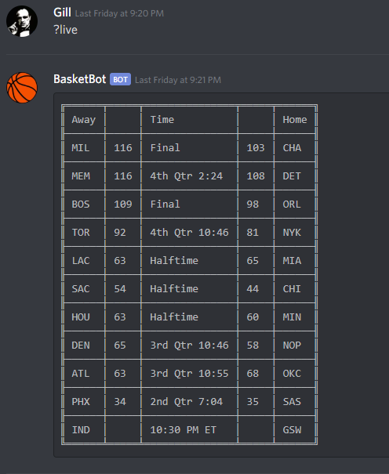
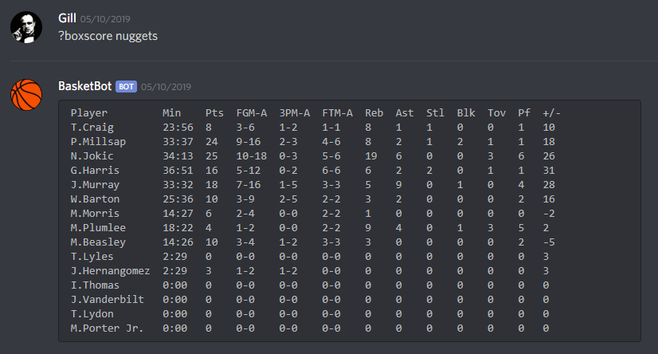
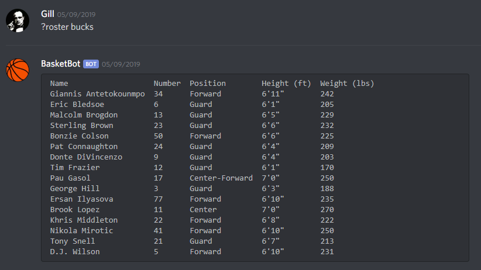
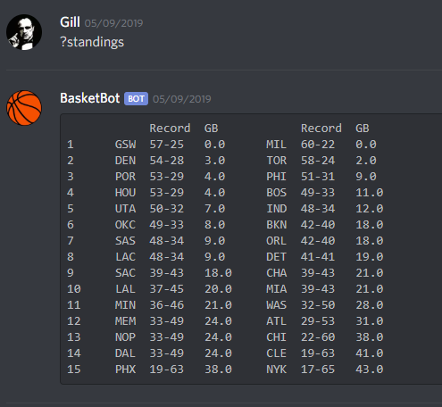

# basketbot
A Discord bot that pulls NBA stats and data

## Requirements
* [discord.js](https://discord.js.org/#/)
* [request](https://www.npmjs.com/package/request)
* [date-and-time](https://www.npmjs.com/package/date-and-time)

## Usage 
You'll need to create a new application under the Discord developer dashboard and obtain an application key/secret. The bot can be turned on by running 'index.js' once you've instered the bot login token at the bottom of the file. Also remember to invite the bot to your Discord server.

## Examples
The bot responds to various queries that are lead on by the default trigger '?'. The current supported query functions are as follows.
* live
    : Retrieve the live score for every NBA game
    
* boxscore
    : Retrieve the full boxscore for a given NBA team
    
* roster
    : Retrieve the full roster for a given NBA team
    
* standings
    : The current up to date standings for the Eastern and Western conference
    

